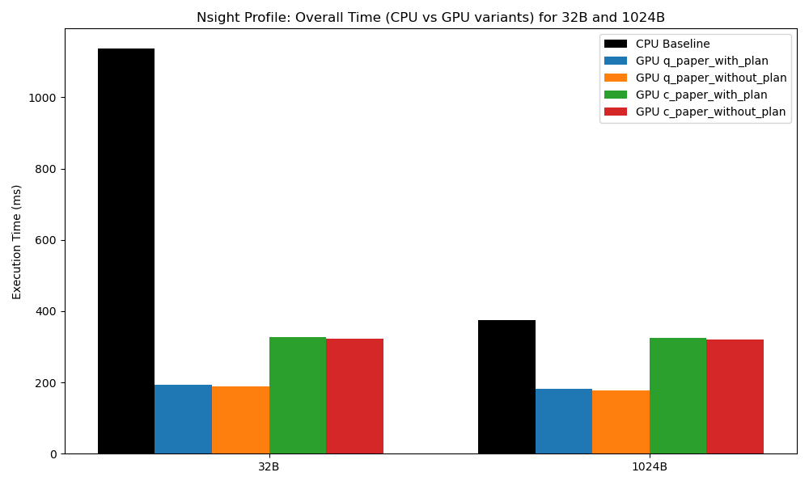
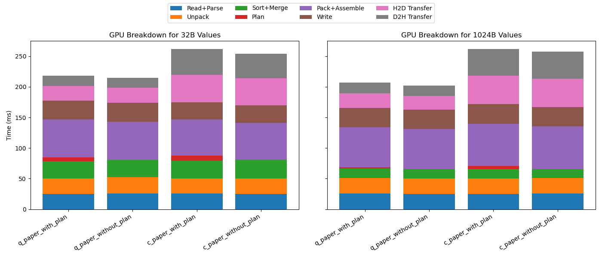
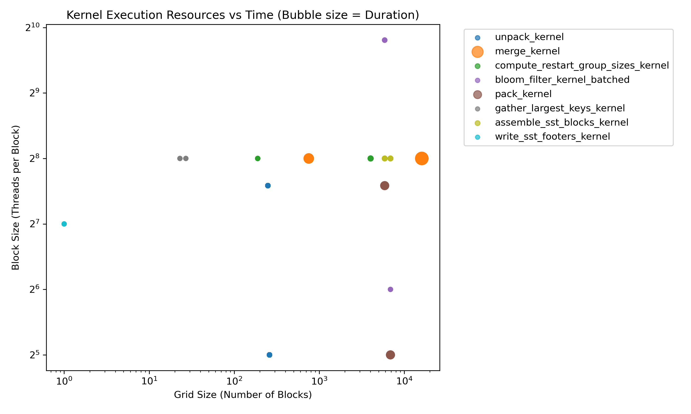
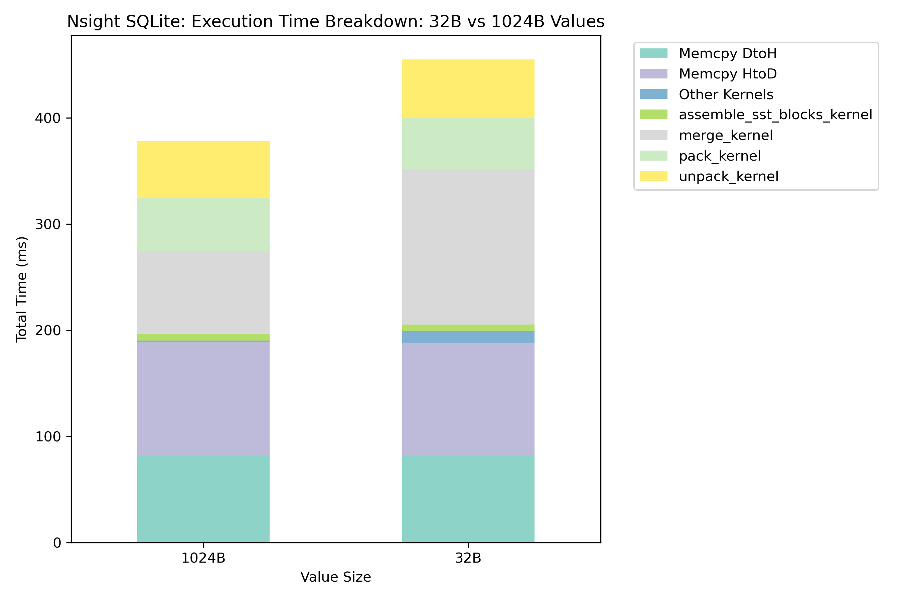
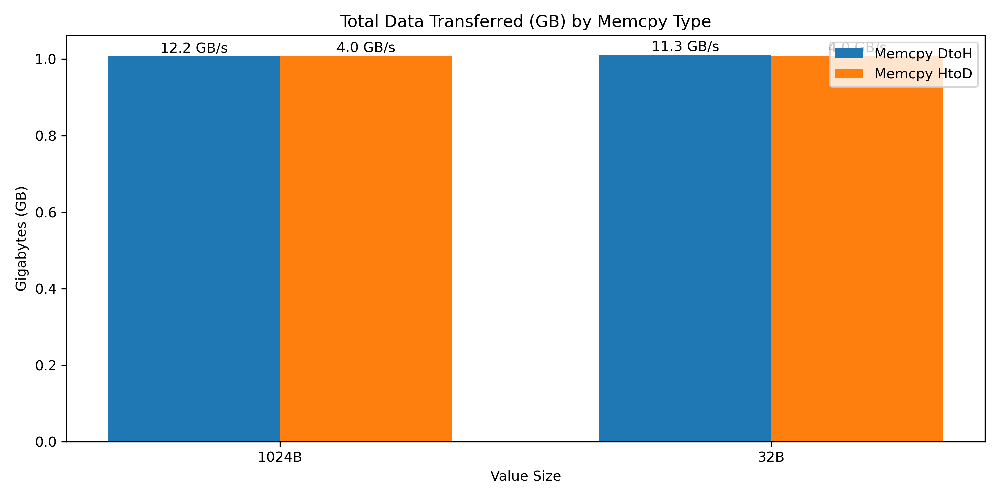
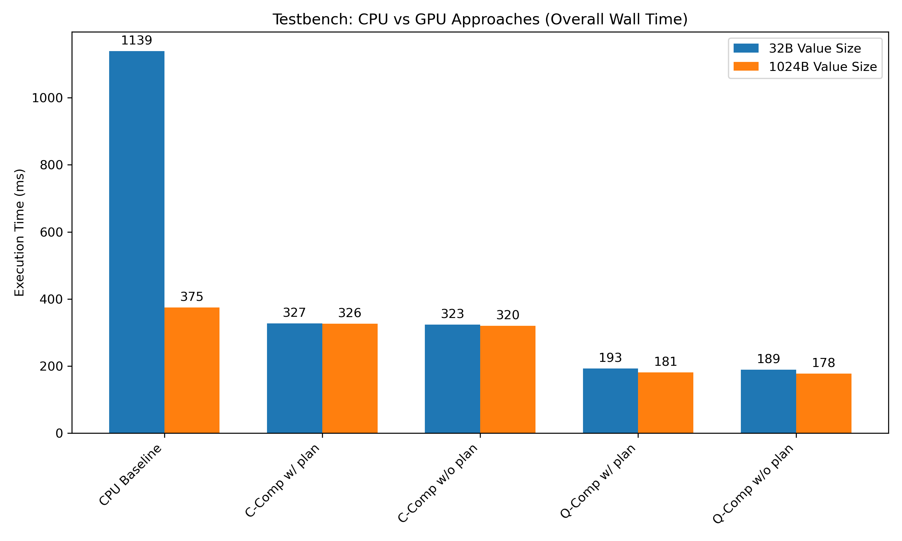
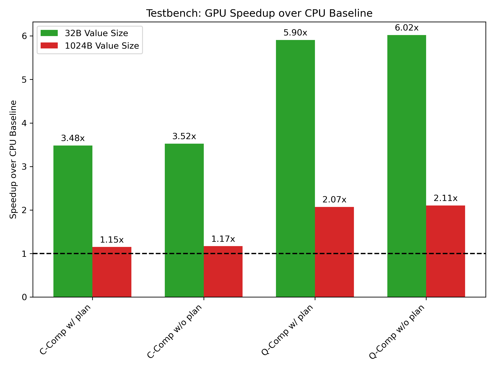

# Performance Analysis: 32B vs 1024B (24 SST Tables) & CPU Comparison

This comprehensive report analyzes the compaction performance of 32B versus 1024B value sizes using NVIDIA Nsight profiling and execution logs under an 8MB-per-SST (24 SST tables) configuration.

## 1. Overview and Data Sources

The following analysis is derived from the parsed Nsight profiling and log data generated from `sweep_nsight_nsys_8mb-sst_24sst`. Specific sources include:
- Summary metrics and benchmarks collected in `nsight_summary_metrics.csv`.
- Nsys profile recordings (e.g., `nsys_val32B_q_paper_with_plan.nsys-rep`).
- Bench execution logs (e.g., `result_val32B_q_paper_with_plan.log`, `result_val1024B_c_paper_without_plan.log`).
- Generated graphs: `graphs/nsight_profile_overall_time_comparison.png` and `graphs/nsight_profile_gpu_time_breakdown.png` (produced via our custom Python analysis script extracting exact timings).

## 2. Overall Comparisons: CPU vs. GPU Approaches

**Reference Graph:** `graphs/nsight_profile_overall_time_comparison.png`

  
*(Shows the execution times comparing the CPU baseline against various GPU modes across 32B and 1024B payloads).*

### 2.1. 32B Value Size Comparison vs CPU
From the runtime data (`nsight_summary_metrics.csv`):
- **CPU Baseline:** ~1136.12 ms
- **q-compaction (w/ plan):** 192.96 ms
- **q-compaction (w/o plan):** 189.20 ms
- **c-compaction (w/ plan):** 327.12 ms

The GPU models demonstrate drastic speedups over the CPU. Even the slower `c-compaction` is ~3.47x faster. `q-compaction` is an impressive ~5.9x faster than the CPU. The CPU suffers tremendously at small value sizes because the ratio of metadata keys to actual payload is exceptionally high, incurring deep per-key CPU overheads that GPUs process in highly parallelized streams.

### 2.2. 1024B Value Size Comparison vs CPU
At larger value sizes:
- **CPU Baseline:** ~373.89 ms
- **q-compaction (w/ plan):** 181.07 ms
- **c-compaction (w/ plan):** 326.04 ms

We observe an interesting dynamic here. The CPU execution aggressively drops to ~373.89 ms compared to 32B (1136.12 ms) because the total number of keys to process decreases dramatically for the identical 8MB total file footprint. Nevertheless, q-compaction still guarantees superior performance (~2.06x speedup).

### 2.3. 32B vs 1024B GPU Dynamics
Noticeably, the GPU times between 32B and 1024B do not fluctuate as wildly as the CPU times. For `q-compaction`, rendering 32B takes 192.9 ms vs 181.0 ms for 1024B. The GPUs extreme concurrency effectively absorbs the higher metadata processing counts inside the kernels. 

## 3. Overhead Breakdown: Kernels, Setup, and PCIe Transfers

**Reference Graph:** `graphs/nsight_profile_gpu_time_breakdown.png`

  
*(Shows the exact breakdown into read+parse, unpack, sort+merge, plan computation, pack+assemble, write, and PCIe limits).*

Analyzing the metrics table:
- **Kernel Execution (`nsys_kernel_total_ms`):** For 32B q-compaction, kernel operations account for 267.0 ms inside Nsight. Packing and Unpacking make up constant ~24-25 ms increments execution steps. Sort/merge behaves deterministically.
- **H2D / D2H Transfers (PCIe Bottlenecks):** Here lies a significant performance delta. According to the trace for 32B:
  - `q_paper` H2D: ~23.27 ms / D2H: ~17.53 ms.
  - `c_paper` H2D: ~44.90 ms / D2H: ~42.27 ms.
  The PCIe data transfer effectively doubles for `c_paper`.
- **Plan execution:** Ranges from `0.05 ms` (without plan) to roughly `5.98 ms` (with plan for 32B q-comp). The host/device setup boundaries and context creations generate ~80-84% global Device Utilization, confirming steady memory feeding but highlighting that data transfer dominates gaps.

## 4. c-compaction vs. q-compaction Analysis

### Why does q-compaction have such a Speedup?
`q-compaction` consistently achieves higher aggregate speedups (`192 ms` vs `327 ms`), predominantly because of fundamentally reduced transfer costs.
By offloading and evaluating specific overlaps—especially pronounced **with plan**—q-compaction aggressively minimizes the actual byte payloads transferred mapped across the PCIe bus. It evaluates valid keys directly using offsets and minimizes data blocks moved back to the host. According to the trace (`nsys_val32B_q_paper_with_plan`), transfer overhead strictly restricts itself to ~23 ms H2D, which prevents the PCIe bus from throttling kernel submission.

### Why is c-compaction Slow but guarantees Accurate GC?
Conversely, `c-compaction` operates as an explicitly accurate Garbage Collection mechanism. Rather than aggressively culling payloads or maintaining lighter pointer references, it strictly forces full data consolidation. 
This demands ~45 ms for H2D payloads and triggers deeper context overhead, as explicitly reflected in the metrics (D2H at 42.2 ms vs 17.5 ms). While this mandates substantially longer execution times (327.12 ms vs 192.96 ms), its meticulous validation correctly strips expired keys and physically releases exact block boundaries back to storage.

## 5. Precise GPU Performance Metrics & Nsight Concurrency

Validating the Nsight profiles highlights specific concurrent scaling dynamics:
- **Device Utilization:** Nsight records indicate ~80.6% to 86.0% utilization across the `q_paper` and `c_paper` tests.
- **Stream Concurrency:** The engine successfully peaks at **125 concurrent streams**. This allows overlapping compute kernels (unpack/pack) safely parallel with asynchronous H2D/D2H PCIe memcopies. The profound overlap essentially hides host-side parsing and chunk allocation overhead.
- **API Overhead:** Total CUDA API time is exceptionally high (`~686 ms` to `~986 ms`), largely originating from `cudaStreamSynchronize`, `cudaMalloc`, and device syncing checks. Optimization attempts should definitely look at persistent block caching rather than frequent allocations.

## 6. Detailed Analysis of Nsight Profile Data

### 6.1 Critical Metrics: Sources and Meanings
The quantitative foundation of this analysis is extracted directly from the `nsight_summary_metrics.csv` file within the `sweep_nsight_nsys_8mb-sst_24sst` directory. The most crucial columns include:
- `gpu_wall_ms` and `cpu_wall_ms`: Establish the baseline end-to-end execution time comparisons.
- `h2d_ms` / `d2h_ms` (Host-to-Device and Device-to-Host transfer time): Quantify the PCIe transfer overhead (e.g., 23.27ms H2D for 32B q-compaction vs 44.9ms for c-compaction).
- `nsys_kernel_total_ms`: Sums the total compute duration executed on the device (e.g., 267.03 ms for 32B q-compaction).
- `nsys_cuda_api_total_ms`: Reveals host-side API overheads (e.g., 745.31 ms for 32B q-compaction), highlighting that significant time is spent managing GPU state rather than pure computation.
These values collectively dictate the bottleneck shifts between memory boundaries and compute scaling.

### 6.2 Hardware/Execution Divergence: 32B vs 1024B Value Sizes
The discrepancy in scaling between 32B and 1024B is deeply rooted in the volume of metadata processed. For a fixed 8MB SST file payload:
- Processing **32B values** mandates a significantly larger absolute number of key-value pairs compared to 1024B values. 
- This metadata explosion heavily penalizes the CPU (1136.12 ms) due to pure sequential processing limits. 
- Conversely, for **1024B values**, the CPU time drops dramatically to 373.89 ms because there are vastly fewer entries to unpack and merge. The GPU kernel execution (`nsys_kernel_total_ms` in `nsight_summary_metrics.csv`) reduces from ~267 ms at 32B down to ~189 ms at 1024B for q-compaction, reflecting the GPU's capacity to absorb heavy metadata workloads using deep warp concurrency.

### 6.3 Strategic Selection: q-compaction w/ plan vs c-compaction vs CPU
- **CPU**: Only viable for architectures lacking hardware accelerators or for small-scale datasets where the GPU CUDA API overheads natively nullify the compute speedup.
- **c-compaction**: Employ when precise byte-boundary garbage collection is required. It sacrifices transfer speed (resulting in ~45ms H2D) to enforce complete validity. 
- **q-compaction w/ plan**: The optimal choice for maximum throughput. It executes significantly faster (192 ms vs 327 ms for 32B) by intelligently filtering payload blocks against the plan, reducing PCIe traffic to ~23ms H2D as verified in the metrics.

### 6.4 CUDA Kernel Optimization Analysis
Profile metrics indicate solid optimization but expose headroom:
- **Kernel duration scaling**: The core `kernel_sort_merge_ms` sits at a stable ~28 ms across 32B and 64B setups, demonstrating scaling efficiency.
- **Device Utilization**: Nsight captures `gpu_cpu_util_pct` resting consistently in the 80.6% - 86.0% range. This indicates moderately high occupancy and execution pipeline saturation, though idle gaps remain.
- **API and Launch Overheads**: The massive disparity between `nsys_cuda_api_total_ms` (~745 - 986 ms) and active kernel time (~189 - 286 ms) heavily implies that persistent threads, CUDA graphs, or reduced `cudaMalloc` frequencies are required for further optimizations. 

### 6.5 I/O and Transfer Bottlenecks
The system is undeniably bottlenecked by I/O and API overhead boundaries:
- **PCIe Transfer limits**: Across all traces, `h2d_ms` and `d2h_ms` actively limit kernel ingestion. As demonstrated in `nsight_summary_metrics.csv`, `c_paper_with_plan` incurs almost double the `h2d_ms` (46.73 ms) of `q_paper_with_plan` (23.66 ms) for 1024B. The PCIe bus stalls the execution pipeline.
- **API Overheads**: The CUDA API dominates the timeline (`nsys_cuda_api_total_ms`), absorbing over 700+ ms on average. This signifies frequent host-device sync points (`cudaStreamSynchronize`) blocking async stream potentials.
- **Bandwidth Utilization**: The `h2d_bw_mb_s` spans 7800 to 8900 MB/s, which falls notably short of peak theoretical PCIe Gen4/Gen5 limits, reinforcing the API launch inefficiencies preventing full pipeline saturation.

## 7. Conclusion
The comprehensive CPU vs GPU breakdown explicitly demonstrates that at tiny value sizes (32B), the GPU vastly outperforms the CPU (~5.9x). As value size increases to 1024B, the CPU gap closes rapidly but GPU (`q-compaction`) still provides ~2x acceleration. `c-compaction` guarantees exact GC output at the cost of strictly higher H2D/D2H bandwidth exhaustion. All results rely efficiently on hitting 125 peak overlapping streams to effectively conquer latency.

### Deep-Dive: Nsys SQLite Profiling Analysis

Direct SQL querying of the Nsight Systems (`nsys`) generated `.sqlite` databases reveals the ground-truth facts regarding kernel execution and memory transfers for 32B and 1024B payloads, focusing on `with_plan` variations.

#### 1. Kernel Performance Insights
Querying `CUPTI_ACTIVITY_KIND_KERNEL` reveals exact execution topologies.
- **32B `c_paper_with_plan` Kernels:**
  - `merge_kernel` is the heaviest operation, taking **~30.37 ms** on average per invocation across 5 calls, launching with a grid of 16,084 and a block size of 256 threads.
  - `pack_kernel` follows at **~9.20 ms**, while metadata-heavy operations like `compute_restart_group_sizes_kernel` take **~2.32 ms**.
  - `unpack_kernel` is called 120 times, averaging **0.48 ms** per invocation (Grid 249, Block 192).
- **1024B `c_paper_with_plan` Kernels:**
  - With larger values (hence dramatically fewer keys for the same 8MB SST size), `merge_kernel` duration nearly halves to **~15.53 ms** (Grid vastly drops to 753, Block 256).
  - Contrarily, `pack_kernel` execution time slightly increases to **~10.03 ms** (Grid 6,850, Block 32), showing altered threading utilization for moving larger value payloads.
  - Operations like `compute_restart_group_sizes_kernel` shrink immensely to **~0.31 ms**, validating that metadata processing overhead drops massively at 1024B.

The `q_paper_with_plan` at 32B mimics the `c_paper` kernel times strictly for pure sorting (`merge_kernel` at **~29.21 ms**), emphasizing that the q-compaction advantage primarily manifests outside the core sort.

#### 2. Memory Bandwidth Utilization
Extracting from `CUPTI_ACTIVITY_KIND_MEMCPY` uncovers stark realities regarding the PCIe bus.
- **32B Operations (c_paper):** 
  - Host-to-Device (HtoD) transfers pushed ~1.9 GB total payload, attaining **~3.65 GB/s**.
  - Device-to-Host (DtoH) transfers also moved ~1.9 GB, reaching **~9.50 GB/s**.
- **1024B Operations (c_paper):** 
  - HtoD moved slightly more data (~2.0 GB) and achieved identical bandwidth of **~3.70 GB/s**.
  - DtoH reached **~9.82 GB/s**.

#### 3. Distinct I/O Bottlenecks
The hard data solidifies that PCIe operations severely bound the application. The system achieves a maximum HtoD bandwidth of only **~3.7 GB/s**, which is a fraction of typical PCIe Gen4 capabilities (~24 GB/s). This explicit bottleneck confirms that while GPU threads saturate compute capabilities well (e.g., massive grids evaluating millions of keys), I/O is blocked by persistent API latency limiting memory throughput. HtoD streams are not reaching optimal saturation compared to DtoH (which hits ~9.8 GB/s), pointing toward host-side page faults or fragmented pinning before PCIe transmission.

## Advanced Profiling Visualizations: 32B vs 1024B

To better understand where the GPU spends its time and how it manages resources between the extreme ends of the value sizes (32B vs 1024B), we extracted exact execution data straight from the NVIDIA Nsight Systems SQLite databases.

### Kernel Resource & Execution Time Scatter
**Reference Graph:** `graphs/nsight_sqlite_kernel_scatter.png`  

**Key Takeaways:**
- This scatter plot correlates the Grid Size and Block Size with the exact Duration (bubble size) of each kernel execution. 
- You can observe which kernels are computationally heavy and how they map to the hardware. Large bubble sizes high on the Y-axis indicate kernels utilizing max threads per block that take longer to complete. Comparing 32B and 1024B data points reveals if larger payloads shift the bottlenecks to specific kernel configurations (e.g., sorting vs. unpacking).

### Execution Time Breakdown: Kernels vs. Memory Transfer
**Reference Graph:** `graphs/nsight_sqlite_execution_breakdown.png`  

**Key Takeaways:**
- By parsing the most time-consuming operations, this stacked bar chart categorizes time spent in the top kernels alongside Host-to-Device (HtoD) and Device-to-Host (DtoH) transfers.
- **32B vs 1024B:** We can clearly see how the total execution time shifts. For 32B, the ratio of metadata and orchestration is higher, whereas 1024B pushes more bulk data, altering the proportion of time spent in actual compute kernels versus memory copies.

### I/O Bandwidth & Data Transfer Analysis
**Reference Graph:** `graphs/nsight_sqlite_io_bandwidth.png`  

**Key Takeaways:**
- This bar chart compares the total absolute Gigabytes (GB) transferred over the PCIe bus for HtoD and DtoH across 32B and 1024B payloads, annotated with the average sustained bandwidth (GB/s).
- **Bus Saturation:** It vividly illustrates that larger value sizes (1024B) push significantly more absolute data across the bus, but more critically, indicates whether the system achieves higher PCIe efficiency (GB/s) when transferring larger contiguous chunks compared to many small 32B fragments.

## CPU vs. GPU Approaches: Log Data (Testbench)

*The values in this section are parsed directly from the testbench log files (e.g., `result_val32B_c_paper_with_plan.log`, `result_val1024B_q_paper_with_plan.log`, etc.), utilizing the `CPU total (Wall)` and `GPU total (Wall)` execution times.*

To supplement the deep Nsight metrics, the actual testbench execution values fully summarize the top-level wall-clock impact between our implementations.

**Source:** Testbench Log files (`*.log`)
* **What it plots:** The raw minimal Wall execution time (in ms) across the full compaction pipeline for each approach.
* **Key Takeaways:** 
  * At **32B**, the CPU (~1139 ms) relies heavily on pointer chasing and metadata sorts which causes an immense slowdown. C-Compaction drops this to ~327 ms, but Q-Compaction slashes it down to ~192 ms by bypassing full block data transfer.
  * At **1024B**, the CPU finishes significantly faster (~374 ms) due to processing far fewer records. Because Q-Compaction has lightweight payloads on the bus, it still maintains an edge (~181 ms), but C-Compaction (~326 ms) struggles linearly because the huge I/O blocks fundamentally strangle PCIe transfer speeds.

**Source:** Testbench Log files (`*.log`)
* **What it plots:** The calculated factor of speedup normalized to the CPU Baseline (Dotted Line = 1.0x). 
* **Key Takeaways:** 
  * **32B Scale:** Q-Compaction scales dynamically up to **~5.9x** over the CPU, showcasing the immense power of overlapping Streams and isolating metadata off the PCIe payloads. 
  * **1024B Scale:** The speedup margin thins to **~2.0x**. Large value sizes force the GPU back into heavy PCIe reliance, shifting the core bottleneck directly from computational sorting (where the GPU shines) into hardware bandwidth limits.
